# **视觉与传感课程设计（以下简称“机甲小师课设”）设计文档与开源报告**

### **贡献人**：机器（创）233    陈光钊

> [!NOTE]
>
> 注意：可以用“微软大战代码”（Microsoft Vscode）打开后鼠标右键选择“打开预览”来看这个报告的markdown文件。

## 0.引言

给大伙看一下我们组机甲小师的“定妆照”……

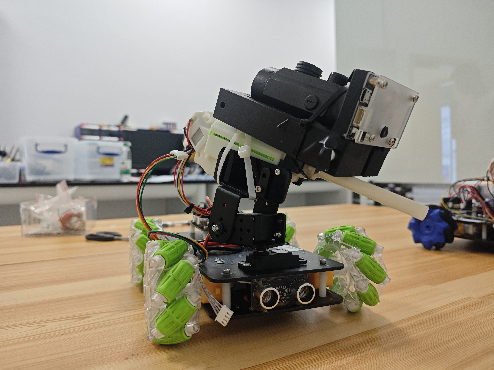


我真的不得不说，这次课设给的火魔童开发板实在很难评——给的资料弄了半天应该是我的Arduino IDE版本太新了以至于那些贡献库都很新结果给来的资料包含的库根本编译不了一点！

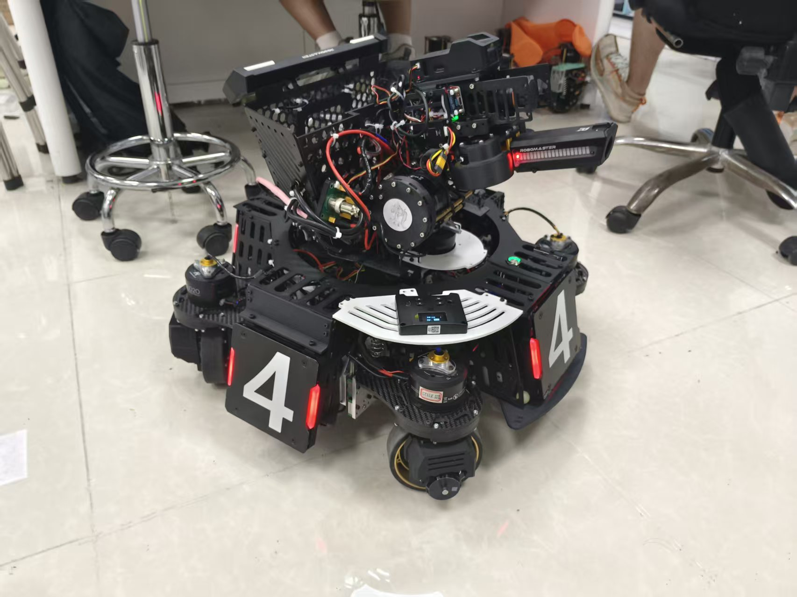

但是别慌，你打过RoboMaster的哨兵电控主力兼机器（创）233班的作者给你们提供一个基于火魔童的版本答案，虽然说这<u>其实也是一个课程设计的报告</u>，但是我<u>必须得交完这个报告后把内容和代码全部开源在GitHub上让更多人看到</u>，当然我也会把我的代码交上来，我真的<u>希望老师们在看到这代码的时候可以也把我的代码分享给以后做这个课设的师弟师妹们！</u>

其实我在上课设之前有很长一段时间没碰过课设而且我也是在验收前一天才开始搭框架速通，之前的时间给RoboMaster庆园阁战队招新和准备保研资料和申研资料去了。~~（请不要质疑一个RoboMaster电控主力老兵的实力）~~所以我们调试的时间很短甚至视觉那边一直是一个问题，就是那个接口（UART）一直没调通所以我们组~~其实没上视觉~~单纯上场的时候都是我（电控）的代码在发力。毫不避讳地说我这一组论技术贡献度我绝对是夯的那一档，但是我希望看到这里的学弟学妹们，你们在开发视觉的时候，第一件事就是：

<u>先写接口，然后测试接口！</u>

<u>先写接口，然后测试接口！</u>

<u>先写接口，然后测试接口！</u>

你写不好接口，没测试过，那你就是在连累你们组的电控！你没写接口，没测试过，我跟你说，你的算法再好再创新都是假的！电控收不到你的消息。所谓算法，目的是好用，但是好用的前提是能用！不能用的算法就是~~垃圾算法~~，一点用都没有还浪费队友时间！所以<u>不要本末倒置！不要本末倒置！不要本末倒置！</u>

## 1.火魔童开发板的开发点和注意事项

### 1.1硬件部分

这是火魔童开发板的图片：

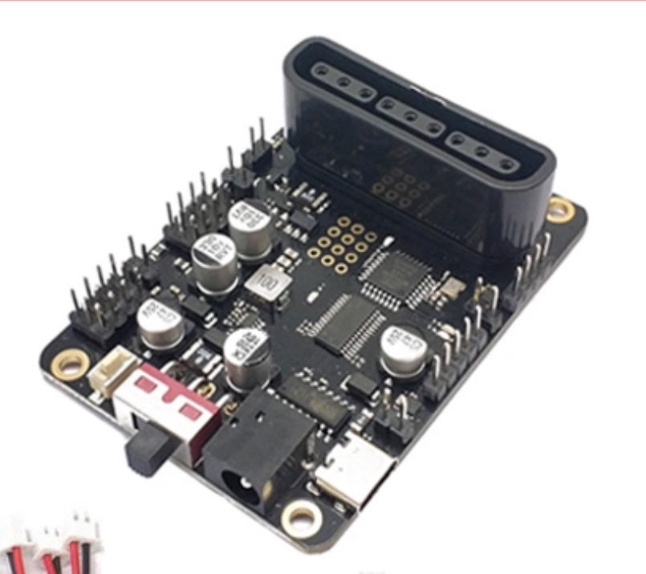

注意看！这块小小的开发板叫火魔童开发板。不要看它小，其实它的功能也很弱（ [doge]

我们的题目其实就是用和RoboMaster的步兵相比差劲非常多的硬件配置然后写成自动哨兵（老师说禁止使用PS2遥控器的时候我天都塌了……）的感觉（ [doge]（RM步兵组队员：别尬黑啊！）

这个开发板上面有四个电机输出口，一个指示灯，一个程序下载口（兼硬串口），一个IIC接口，一个UART接口，还有一个不知所以非常抽象的……IO输出口（接继电器后再从继电器接口输出接到发射机构），还有10多路自定义IO口（其实这板子的IO口并不多）。

火魔童开发板的主控芯片是ATmega328P，没错，它的<u>典型系统开发板</u>就是——Arduino UNO R3，也就是下面这货：

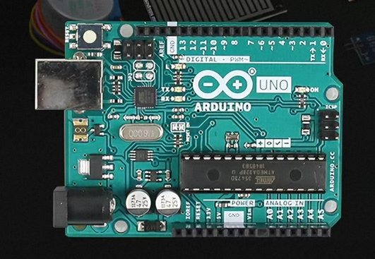

纯纯嵌入式开发者眼中的玩具来的（ [doge]

其实，说白了，你说这个开发板叫火魔童开发板，我更愿意叫它“火魔丸”开发板，它的生态太差了！我想去找商家要资料，他们还必须要我自己购买才给~~（所以我这个开源就是用来打击资本的！）~~。而且我让我们实验室的硬件组用放大镜+淘宝搜索，才知道这个开发板有些芯片，比如那个H桥芯片，就只有一个商家提供，太冷门了，基本很难才收得到这个H桥芯片。

说到H桥芯片，我来解释一下为什么这个板子要用到H桥，你猜猜为什么这块板子可以直接驱动电机？我直说了，这块板子接口没有那么多的硬件PWM（虽然你可以弄一个模拟PWM），但是这块板子控制可以控制4个电机其实没有用到Arduino UNO R3的硬件PWM，而是使用了一个用IIC协议通讯的芯片——PCA9685，一个16路PWM发生器来发生PWM波，而这个芯片跟Arduino UNO R3就是用IIC通信，Arduino通过IIC的消息来告诉PCA9685哪几路输出PWM波，在这个火魔童的板子上，驱动4个电机就需要8路PWM波（因为要有调速环节，虽然是开环的……）而这8路PWM分别是PCA9685的3、4、5、6、9、10、11、12号输出口。而这几路的PWM输出口也不可以直接输出给电机，而是要经过H桥驱动芯片才可以驱动（这个电机不是我们说的那些诸如FOC那一类三相的电机，一般只适用于马达）。H桥芯片的最终输出才会给到电机。

再说一下火魔童开发板上的用户可自定义的LED灯，其实这方面火魔童开发板的创造者还算有一点点人性，知道按照Arduino UNO R3的标准来——就是引脚13在发力！正常使用“pinMode(LED_BUILTIN, OUTPUT);”和“digitalWrite（）”这两个函数分别初始化引脚和控制引脚高低电平来控制灯的亮灭的。

其实那个控制发射机构的引脚可以找一个不输出硬件PWM的来，其实只是高低电平控制发射机构开关的，也是“pinMode（）”和digitalWrite（）”这两玩意儿在发力。但是必须要注意，必须使用继电器模块，这不是偶然的提醒，是我根据经验和理论告诉你，必须使用继电器模块！！！你以为你这个控制发射机构的输出引脚可以带的动一个电机？发射机构里面其实就是一个电机！！！你胆敢用一个单片机输出引脚直接控制电机，~~你NB~~，等着引脚坏掉或者炸板子吧孩子。单片机引脚输出的电流很小的，根本带不动一个小马达，性能最差的马达都觉得单片机的输出引脚是一个小卡拉米，所以必须使用继电器连接输出引脚和电机做好驱动和保护措施，而且建议单独用一个电池给发射机构供电，因为发射机构电机启动的瞬间可能会有很强的浪涌电流（有些小组会有这种现象但是有些小组没有）导致给到火魔童开发板的电流过小触发火魔童开发板的重启。我们的小车就是使用了双电池方案，一个电池给火魔童开发板和电机供电，另一个电池给发射机构供电。

### 1.2软件部分

因为作者习惯了RoboMaster电控的开发流程，而且担心基于裸机开发的火魔童开发板会出现~~**狮山代码**~~的情况，所以我决定使用FreeRTOS来编写电控框架。本次架构中有四个thread，一个是主线程用于和视觉模块通讯，一个是底盘线程用于控制底盘，一个是云台线程用于控制云台和发射机构，一个是发射机构线程经过修改最后用于处理传感器数据。

> [!WARNING]
>
> 经过测试，发现火魔童开发板最多只能写4个thread，不可以再多了，再多就导致程序无法运行了！

当然，除了使用FreeRTOS来搭框架这个特点，本工程还有多文件协同处理的程序的特点，如下图：

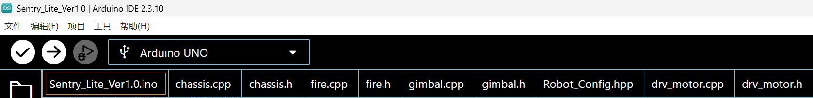

图中，Sentry_Lite_Ver1.0.ino文件就是用来创建线程和运行主线程的，chassis.cpp&.h、gimbal.cpp&.h分别是底盘线程和云台线程的运行文件，fire.cpp&.h最后变为处理传感器的线程。Robot_Config.hpp是储存机器人一些性能参数的文件，而又“drv”前缀的文件就是驱动库文件，如图，“drv_motor.cpp”&"drv_motor.h"就是电机的驱动库文件。所有代码和调试均由作者一人完成。

#### 1.2.1驱动层

本次作者仅封装了电机的驱动层，代码如下：

drv_motor.cpp

```
#include "drv_motor.h"
#include <Adafruit_PWMServoDriver.h>

extern Adafruit_PWMServoDriver chassis_motor;

Drv_motor_Info_t Chassis_Motor[4];

void chassis_motor_init() {
  Chassis_Motor[0].id    = 1;
  Chassis_Motor[0].speed = 0;

  Chassis_Motor[1].id    = 2;
  Chassis_Motor[1].speed = 0;

  Chassis_Motor[2].id    = 3;
  Chassis_Motor[2].speed = 0;

  Chassis_Motor[3].id    = 4;
  Chassis_Motor[3].speed = 0;

  chassis_motor.writeMicroseconds( 3, 0);
  chassis_motor.writeMicroseconds( 4, 0);
  chassis_motor.writeMicroseconds( 5, 0);
  chassis_motor.writeMicroseconds( 6, 0);
  chassis_motor.writeMicroseconds( 9, 0);
  chassis_motor.writeMicroseconds(10, 0);
  chassis_motor.writeMicroseconds(11, 0);
  chassis_motor.writeMicroseconds(12, 0);
}

void set_motor_speed(int8_t id, int16_t speed){
  if(id == 1){
    if(fabs(speed) >= 1500 && fabs(speed) < 4096){
      Chassis_Motor[0].speed = speed;
    }else{
      return;
    }
  }else if(id == 2){
    if(fabs(speed) >= 1500 && fabs(speed) < 4096){
      Chassis_Motor[1].speed = speed;
    }else{
      return;
    }
  }else if(id == 3){
    if(fabs(speed) >= 1500 && fabs(speed) < 4096){
      Chassis_Motor[2].speed = speed;
    }else{
      return;
    }
  }else if(id == 4){
    if(fabs(speed) >= 1500 && fabs(speed) < 4096){
      Chassis_Motor[3].speed = speed;
    }else{
      return;
    }
  }else{
    return;
  }
}

void motor_driver(){
  if(Chassis_Motor[0].speed > 0){
    chassis_motor.writeMicroseconds( 3, set_speed_pwm(Chassis_Motor[0].speed));//1500~2000
    chassis_motor.writeMicroseconds( 4, 0);
  }else{
    chassis_motor.writeMicroseconds( 3, 0);//1500~2000
    chassis_motor.writeMicroseconds( 4, set_speed_pwm(Chassis_Motor[0].speed));
  }
  if(Chassis_Motor[1].speed > 0){
    chassis_motor.writeMicroseconds( 5, set_speed_pwm(Chassis_Motor[1].speed));//1500~2000
    chassis_motor.writeMicroseconds( 6, 0);
  }else{
    chassis_motor.writeMicroseconds( 5, 0);//1500~2000
    chassis_motor.writeMicroseconds( 6, set_speed_pwm(Chassis_Motor[1].speed));
  }
  if(Chassis_Motor[2].speed > 0){
    chassis_motor.writeMicroseconds( 9, set_speed_pwm(Chassis_Motor[2].speed));//1500~2000
    chassis_motor.writeMicroseconds(10, 0);
  }else{
    chassis_motor.writeMicroseconds( 9, 0);//1500~2000
    chassis_motor.writeMicroseconds(10, set_speed_pwm(Chassis_Motor[2].speed));
  }
  if(Chassis_Motor[3].speed > 0){
    chassis_motor.writeMicroseconds(11, set_speed_pwm(Chassis_Motor[3].speed));//1500~2000
    chassis_motor.writeMicroseconds(12, 0);
  }else{
    chassis_motor.writeMicroseconds(11, 0);//1500~2000
    chassis_motor.writeMicroseconds(12, set_speed_pwm(Chassis_Motor[3].speed));
  }
}

void chassis_calc(int vel_x, int vel_y, int omega){
  Chassis_Motor[0].speed = vel_x + vel_y + omega;
  Chassis_Motor[1].speed = vel_x - vel_y + omega;
  Chassis_Motor[2].speed = vel_x - vel_y - omega;
  Chassis_Motor[3].speed = vel_x + vel_y - omega;

  set_motor_speed(1, Chassis_Motor[0].speed);
  set_motor_speed(2, Chassis_Motor[1].speed);
  set_motor_speed(3, Chassis_Motor[2].speed);
  set_motor_speed(4, Chassis_Motor[3].speed);
}
```

drv_motor.h

```
#ifndef DRV_MOTOR_H
#define DRV_MOTOR_H

#include <stdint.h>

#define set_speed_pwm(x) (x >= 0 ? x : -x)

typedef struct{
  int8_t  id;
  int16_t speed;
}Drv_motor_Info_t;

void chassis_motor_init();

void set_motor_speed(int8_t id, int16_t speed);

void motor_driver();

void chassis_calc(int vel_x, int vel_y, int omega);

#endif
```

这个库其实包含了底盘电机的驱动代码和底盘整体运动学解算的代码。

先看一下这个库里面的函数

##### 1.2.1.1 chassis_motor_init

```
void chassis_motor_init()
```

这个函数其实是火魔丸开发板独有的电机初始化函数（PCA9685初始化），它的作用就是告诉PCA9685哪几路输出PWM波。

##### 1.2.1.2 set_motor_speed

```
void set_motor_speed(int8_t id, int16_t speed)
```

这个函数就是用来设置哪个电机正（逆）时针转多少速度的（无量纲），形参id就是火魔童开发板对应的某一路，speed是需要转的速度（包括大小和方向，允许负数）。

##### 1.2.1.3 motor_driver

```
void motor_driver()
```

这是设置完电机速度后的最终驱动函数，到这一步就可以让火魔童开发板的H桥芯片驱动电机了！

##### 1.2.1.4 chassis_calc

```
void chassis_calc(int vel_x, int vel_y, int omega)
```

这个是专门用来给麦克纳姆轮底盘解算使用的函数，在设置底盘所有电机速度前，可以使用这个函数先结算一下在目标的x方向、y方向的线速度和角速度下每个底盘电机的输出速度，然后再将算出来的每个电机的速度值扔给set_motor_speed设置电机速度。

以上就是驱动层。

#### 1.2.2应用层

在这里我会介绍一下每一个thread的详细工作，并且给大家留出一个空白框架，供大家以后根据课设的任务补充。

在这之前，我先补充一下Robot_Config.hpp（所有参数意义看注释！）还有void setup()这个初始化函数里面的一些基本操作都讲了些什么：

Robot_Config.hpp

```
#ifndef ROBOT_CONFIG_H
#define ROBOT_CONFIG_H

#define CHASSIS_MAX_VEL   100 \\ 底盘线速度最大值

#define YAW_ANGLE_INIT     90 \\ yaw轴舵机初始角度（需要人为标定）
#define PITCH_ANGLE_INIT  100 \\ pitch轴舵机初始角度（需要人为标定）

#define YAW_WORKRANGE     180 \\ yaw轴工作空间
#define PITCH_WORKRANGE    20 \\ pitch轴工作空间

#define AMMO_BOOSTER        2 \\ 发射机构引脚编号

#endif
```

void setup

```
void setup() {
  // put your setup code here, to run once:
  Serial.begin(115200);              

  // 用户自定义LED灯初始化配置
  pinMode(LED_BUILTIN, OUTPUT);
  
  // 发射机构输出IO口初始化配置
  pinMode(AMMO_BOOSTER, OUTPUT);

  // 舵机初始化配置
  yaw_servo.attach(5);
  pitch_servo.attach(6);
  
  // 火魔童的PCA9685初始化配置
  chassis_motor.begin();          
  chassis_motor.setPWMFreq(50);

  // 创建线程
  xTaskCreate(
    chassis_ctrl_node,          // 任务函数
    "chassis_ctrl_node",        // 任务名称
    128,                        // 堆栈大小
    NULL,                       // 参数
    1,                          // 优先级
    NULL                        // 任务句柄
  );

  xTaskCreate(
    gimbal_ctrl_node,           // 任务函数
    "gimbal_ctrl_node",         // 任务名称
    128,                        // 堆栈大小
    NULL,                       // 参数
    1,                          // 优先级
    NULL                        // 任务句柄
  );

  xTaskCreate(
    radar_node,                 // 任务函数
    "radar_node",               // 任务名称
    128,                        // 堆栈大小
    NULL,                       // 参数
    1,                          // 优先级
    NULL                        // 任务句柄
  );

  xTaskCreate(
    master_node,                // 任务函数
    "master_node",              // 任务名称
    128,                        // 堆栈大小
    NULL,                       // 参数
    1,                          // 优先级
    NULL                        // 任务句柄
  );
  
  // 启动调度器
  vTaskStartScheduler();
}
```

下文说一下文件Sentry_Lite_Ver1.0.ino——所有线程的缔造者（Master！！！）

##### 1.2.2.1 主线程

```
#include <PS2X_lib.h> \\ 这个没用
#include <Wire.h>
#include <Servo.h>
#include <Adafruit_PWMServoDriver.h>
#include <Arduino_FreeRTOS.h>
#include "Robot_Config.hpp"
#include "chassis.h"
#include "gimbal.h"
#include "fire.h"
#include <Arduino.h>

#define Head_Frame 0xAA  \\ 接口通讯帧头
#define Tail_Frame 0x55  \\ 接口通讯帧尾

#define PKT_LEN    7     \\ 数据包长度

uint8_t win[PKT_LEN];    \\ 接收缓冲区 

int8_t  IsFire = 0;
int16_t yaw_offset = 0;
int16_t pitch_offset = 0;

float   cm = 0.0f;
float   cm_last = 0.0f;

bool    pktReady = false;

bool    IsWall   = false; 

void master_node(void *pvParameters);

Adafruit_PWMServoDriver chassis_motor = Adafruit_PWMServoDriver(0x60); \\ 必须要有这个，不然也是没办法初始化PCA9685的

PS2X                    ps2x; \\ 这个没用

Servo                   yaw_servo;
Servo                   pitch_servo;

bool                    IsAttack = false;

int                     yaw_angle   = 0;
int                     pitch_angle = 0;

int                     chassis_speed_x = 0;
int                     chassis_speed_y = 0;
int                     chassis_omega   = 0;

void feedByte(uint8_t b) {
  // 窗口左移，新字节进队尾
  for (uint8_t i = 0; i < PKT_LEN - 1; i++) win[i] = win[i + 1];
  win[PKT_LEN - 1] = b;

  if (win[0] == Head_Frame && win[PKT_LEN - 1] == Tail_Frame) {
    IsFire = win[1];
    yaw_offset = win[2] | (win[3] << 8);
    pitch_offset = win[4] | (win[5] << 8);
    pktReady = true;
  }
}

void setup() {
  // put your setup code here, to run once:
  Serial.begin(115200);              

  pinMode(LED_BUILTIN, OUTPUT);
  pinMode(AMMO_BOOSTER, OUTPUT);

  yaw_servo.attach(5);
  pitch_servo.attach(6);
  
  chassis_motor.begin();
  chassis_motor.setPWMFreq(50);

  xTaskCreate(
    chassis_ctrl_node,          // 任务函数
    "chassis_ctrl_node",        // 任务名称
    128,                        // 堆栈大小
    NULL,                       // 参数
    1,                          // 优先级
    NULL                        // 任务句柄
  );

  xTaskCreate(
    gimbal_ctrl_node,           // 任务函数
    "gimbal_ctrl_node",         // 任务名称
    128,                        // 堆栈大小
    NULL,                       // 参数
    1,                          // 优先级
    NULL                        // 任务句柄
  );

  xTaskCreate(
    radar_node,                 // 任务函数
    "radar_node",               // 任务名称
    128,                        // 堆栈大小
    NULL,                       // 参数
    1,                          // 优先级
    NULL                        // 任务句柄
  );

  xTaskCreate(
    master_node,                // 任务函数
    "master_node",              // 任务名称
    128,                        // 堆栈大小
    NULL,                       // 参数
    1,                          // 优先级
    NULL                        // 任务句柄
  );
  
  // 启动调度器
  vTaskStartScheduler();
}

void master_node(void *pvParameters){
  uint64_t uart_tick    = 0;
  bool     uart_timeout = false;

  for(;;){
    uart_tick++;
    if(Serial.available() > 0){
      feedByte(Serial.read()); 
      uart_tick = 0;
      uart_timeout = false;
    }

    if(uart_tick > 30){
      uart_tick = 30;
      uart_timeout = true;
    }

    if(uart_timeout){
      IsFire = 0;
      yaw_offset = 0;
      pitch_offset = 0;
    }

    if(IsFire != 0){
      IsAttack = true;
    }else{
      IsAttack = false;
    }
    
    vTaskDelay(1);
  }
}

void loop() {
  // put your main code here, to run repeatedly:

}
```

可以看到这里创造了4个thread

```
  xTaskCreate(
    chassis_ctrl_node,          // 任务函数
    "chassis_ctrl_node",        // 任务名称
    128,                        // 堆栈大小
    NULL,                       // 参数
    1,                          // 优先级
    NULL                        // 任务句柄
  );

  xTaskCreate(
    gimbal_ctrl_node,           // 任务函数
    "gimbal_ctrl_node",         // 任务名称
    128,                        // 堆栈大小
    NULL,                       // 参数
    1,                          // 优先级
    NULL                        // 任务句柄
  );

  xTaskCreate(
    radar_node,                 // 任务函数
    "radar_node",               // 任务名称
    128,                        // 堆栈大小
    NULL,                       // 参数
    1,                          // 优先级
    NULL                        // 任务句柄
  );

  xTaskCreate(
    master_node,                // 任务函数
    "master_node",              // 任务名称
    128,                        // 堆栈大小
    NULL,                       // 参数
    1,                          // 优先级
    NULL                        // 任务句柄
  );
```

这里说的"chassis_ctrl_node"、"gimbal_ctrl_node"、"radar_node"和"master_node"4个节点分别是底盘控制线程、云台（及其发射机构）控制线程、雷达（其实是超声波测距）线程和主线程，前三个线程分别存在于chassis.cpp、gimbal.cpp和fire.cpp之中。

所有的机器人相关全局变量都在这个文件，其它应用层文件基本都是外部声明（extern）这个文件里的变量，不存在其它应用层文件有自己的独立全局变量。

那么现在我们说明一下这个文件里有用的变量（代码里有但是这里没说那么说明那个变量作用不大或者没意义，你们可以在拿到代码的时候根据需求考虑是否要删掉）：

###### 1.2.2.1.1  win[PKT_LEN]

```
uint8_t win[PKT_LEN]; 
```

这是一个数据类型为uint8_t的与视觉通讯的接收缓冲区数组，其中的PKT_LEN是一个宏定义（如下）：

```
#define PKT_LEN    7
```

它的含义就是这个接收缓冲区数组的长度，包括了帧头、帧尾。具体[通讯协议](#1.2.2.1.9 串口接收解包函数与通讯协议)在下文会讲。

###### 1.2.2.1.2  IsFire

```
int8_t  IsFire = 0;
```

这是一个数据类型为int8_t的用于判断是否开火的数据，来源是根据视觉[通讯协议](#1.2.2.1.9 串口接收解包函数与通讯协议)来确认的，但是纯电控方案里也可以用。这个值为0的时候是不开火指令，反之（不为0时）是开火指令。

###### 1.2.2.1.3  yaw_offset & pitch_offset

```
int16_t yaw_offset   = 0;
int16_t pitch_offset = 0;
```

这两个变量数据类型为int16_t，是根据视觉[通讯协议](#1.2.2.1.9 串口接收解包函数与通讯协议)来确认的用于告诉云台的航向角和俯仰角需要往哪个方向转多少度的。

###### 1.2.2.1.4 cm & cm_last

```
float   cm      = 0.0f;
float   cm_last = 0.0f;

bool    IsWall  = false;
```

两个float的数据实际是超声波测距本次采样周期测出的距离和上一采样周期测出的距离，两个数据结合起来通过低通滤波更新获得最终的变量cm。

另外，变量IsWall是判断是否需要停下的状态位，如果低通滤波后更新的变量cm到达某一个阈值，就可以将变量IsWall赋值为true。其它状态都是false。

###### 1.2.2.1.5 chassis_motor

```
Adafruit_PWMServoDriver chassis_motor = Adafruit_PWMServoDriver(0x60);
```

这其实是一个对象，因为Adafruit_PWMServoDriver其实是一个类（class）。

这个类是在<Adafruit_PWMServoDriver.h>里面的，具体定义如下：

```
/*!
 *  @brief  Class that stores state and functions for interacting with PCA9685
 * PWM chip
 */
class Adafruit_PWMServoDriver {
 public:
  Adafruit_PWMServoDriver();
  Adafruit_PWMServoDriver(const uint8_t addr);
  Adafruit_PWMServoDriver(const uint8_t addr, TwoWire& i2c);
  bool begin(uint8_t prescale = 0);
  void reset();
  void sleep();
  void wakeup();
  void setExtClk(uint8_t prescale);
  void setPWMFreq(float freq);
  void setOutputMode(bool totempole);
  uint16_t getPWM(uint8_t num, bool off = false);
  uint8_t setPWM(uint8_t num, uint16_t on, uint16_t off);
  void setPin(uint8_t num, uint16_t val, bool invert = false);
  uint8_t readPrescale(void);
  void writeMicroseconds(uint8_t num, uint16_t Microseconds);

  void setOscillatorFrequency(uint32_t freq);
  uint32_t getOscillatorFrequency(void);

 private:
  uint8_t _i2caddr;
  TwoWire* _i2c;
  Adafruit_I2CDevice* i2c_dev = NULL; ///< Pointer to I2C bus interface

  uint32_t _oscillator_freq;
  uint8_t read8(uint8_t addr);
  void write8(uint8_t addr, uint8_t d);
};
```

不难看出，这里就是跟IIC（或叫I2C）有关了。说白了，这其实就是PCA9685的驱动库，官方有的，直接下载后导入就行，具体操作我在文章[倒数第二部分](#2.Arduino IDE基本操作)会教。

说回正题，这个对象定义是火魔童开发板控制电机极为相关，因为我的电机驱动库里外部声明了这个对象：

```
extern Adafruit_PWMServoDriver chassis_motor;
```

所以这个对象~~打亖都不能删~~。

###### 1.2.2.1.6 yaw_servo & pitch_servo

```
Servo                   yaw_servo;
Servo                   pitch_servo;
```

这两个也是对象来的，类Servo来自文件<Servo.h>，这两个对象跟机器人云台上的航向角舵机和俯仰角舵机有关。

###### 1.2.2.1.7 IsAttack

```
bool                    IsAttack = false;
```

说实在话，我觉得这个有一点点多余，其实也是一个用于判断是否进入工具状态的状态位，用法如下：

```
if(IsFire != 0){
  IsAttack = true;
}else{
  IsAttack = false;
}
```

###### 1.2.2.1.8 机器人相关运动控制设定值

```
int                     yaw_angle       = 0;
int                     pitch_angle     = 0;

int                     chassis_speed_x = 0;
int                     chassis_speed_y = 0;
int                     chassis_omega   = 0;
```

我相信聪明的你一定明白这些都是做什么的，~~不明白就代表你不聪明（ [doge]~~

下文介绍一下跟主线程有关的代码段或函数

###### 1.2.2.1.9 串口接收解包函数与通讯协议

解包函数就是：

```
void feedByte(uint8_t b) {
  for (uint8_t i = 0; i < PKT_LEN - 1; i++) win[i] = win[i + 1];
  win[PKT_LEN - 1] = b;

  if (win[0] == Head_Frame && win[PKT_LEN - 1] == Tail_Frame) {
    IsFire = win[1];
    yaw_offset = win[2] | (win[3] << 8);
    pitch_offset = win[4] | (win[5] << 8);
    pktReady = true; // 测试能不能收到数据的标志位
  }
}
```

这个函数开始只是将接收到的数据放到上面提到的[串口接收缓冲区](#1.2.2.1.1  win[PKT_LEN])里面，然后解包情况（通讯协议）如下：

| 偏移 | 长度 | 字段         | 说明                                                  |
| ---- | ---- | ------------ | ----------------------------------------------------- |
| 0    | 1    | Head_Frame   | 帧头（0xAA）                                          |
| 1    | 1    | IsFire       | [开火状态位](#1.2.2.1.2  IsFire)                      |
| 2    | 2    | yaw_offset   | [航向角偏移值](#1.2.2.1.3  yaw_offset & pitch_offset) |
| 4    | 2    | pitch_offset | [俯仰角偏移值](1.2.2.1.3  yaw_offset & pitch_offset)  |
| 6    | 1    | Tail_Frame   | 帧尾（0x55）                                          |

###### 1.2.2.1.10 主线程全代码一览

```
void master_node(void *pvParameters){
  uint64_t uart_tick    = 0;
  bool     uart_timeout = false;

  for(;;){
    uart_tick++;
    if(Serial.available() > 0){
      feedByte(Serial.read()); 
      uart_tick = 0;
      uart_timeout = false;
    }

    if(uart_tick > 30){
      uart_tick = 30;
      uart_timeout = true;
    }

    if(uart_timeout){
      IsFire = 0;
      yaw_offset = 0;
      pitch_offset = 0;
    }

    if(IsFire != 0){
      IsAttack = true;
    }else{
      IsAttack = false;
    }
    
    vTaskDelay(1);
  }
}
```

> [!TIP]
>
> 这段代码最好别删，或者微调一下IsFire的判定部分。

主线程里面主要负责的就是通讯的解包处理和通讯安全保护，首先每执行一次主线程uart_tick会自增，只有串口收到数据的时候uart_tick才会置零，如果没有收到串口的数据，那么uart_tick会自增到值大于30的时候将连接中断标志位uart_timeout置为true，在uart_timeout为true的时候所有接收解包的数据（IsFire、yaw_offset和pitch_offset）全部清0，从而起到安全保护的作用。

> [!NOTE]
>
> 这其实就是我们日常生活中常见的“连接超时”。

说完主线程，那么我们再来说一下其它线程。

#### 1.2.3 底盘线程

打开chassis.cpp我们可以看到：

```
#include <stdint.h>
#include <Adafruit_PWMServoDriver.h>
#include "HardwareSerial.h"
#include <Arduino_FreeRTOS.h>
#include "chassis.h"
#include <Arduino.h>
#include "Robot_Config.hpp"
#include "drv_motor.h"

extern bool                    IsAttack;
extern bool                    IsWall;

extern int8_t                  IsFire;

extern int                     chassis_speed_x;
extern int                     chassis_speed_y;
extern int                     chassis_omega;

void chassis_ctrl_node(void *pvParameters){
  uint64_t action_tick = 0;
  uint8_t  action_flag = 2;

  chassis_speed_x = 0;
  chassis_speed_y = 0;
  chassis_omega   = 0;
  
  chassis_motor_init();

  for (;;) {
    action_tick++;
  
    if(action_flag == 2){
      chassis_speed_x = 2000;
      chassis_speed_y = 0;
      chassis_omega   = 0;

      if(action_tick > 100){
        if(IsWall){
          action_flag += 1;
          action_tick = 0;
        }
      }
    }else if (action_flag == 3){
      chassis_speed_x = 0;
      chassis_speed_y = 0;
      chassis_omega   = -2000;

      if(action_tick > 26){
        action_flag += 1;
        action_tick = 0;
      }
    }else if (action_flag == 4){
      chassis_speed_x = 1800;
      chassis_speed_y = 0;
      chassis_omega   = 0;

      if(action_tick > 110){
        action_flag += 1;
        action_tick = 0;
      }
    }else if(action_flag == 5){
      chassis_speed_x = 0;
      chassis_speed_y = 0;
      chassis_omega   = -2000;

      if(action_tick > 23){
        action_flag += 1;
        action_tick = 0;
      }
    }else if(action_flag == 6){
      chassis_speed_x = 1800;
      chassis_speed_y = 0;
      chassis_omega   = 0;

      if(action_tick > 100){
        action_flag += 1;
        action_tick = 0;
      }
    }else if(action_flag == 7){
      chassis_speed_x = 0;
      chassis_speed_y = 0;
      chassis_omega   = 0;

      IsFire          = 1;
    }
    else{
      chassis_speed_x = 0;
      chassis_speed_y = 0;
      chassis_omega   = 0;
    }
    
    

    if(IsAttack){
      chassis_calc(0, 0, 0);
    }else{      
      chassis_calc(SPEED_MAPPING(chassis_speed_x), 
                   SPEED_MAPPING(chassis_speed_y), 
                   SPEED_MAPPING(chassis_omega));
    }

    motor_driver();
    
    vTaskDelay(1);
  }
}

```

这里没有任何的自定义全局变量，也没有任何宏定义，以下的变量

```
extern bool                    IsAttack;
extern bool                    IsWall;

extern int8_t                  IsFire;

extern int                     chassis_speed_x;
extern int                     chassis_speed_y;
extern int                     chassis_omega;
```

都是外部声明了主文件定义的变量。

上述的代码其实是对抗赛的代码，各位可以根据需求改成如下形式：

```
void chassis_ctrl_node(void *pvParameters){
  /*
    /* 自己定义的动作组标志 */
  */

  chassis_speed_x = 0;
  chassis_speed_y = 0;
  chassis_omega   = 0;
  
  chassis_motor_init();

  for (;;) {
    
  
    /*
      /* 想要让底盘做出什么样的运动或者做什么样的动作组（结合自己定义的动作组标志） */
    */
    

    if(IsAttack){
      chassis_calc(0, 0, 0); // 或者你想在云台打击敌人的时候怎么走
    }else{      
      chassis_calc(SPEED_MAPPING(chassis_speed_x), 
                   SPEED_MAPPING(chassis_speed_y), 
                   SPEED_MAPPING(chassis_omega));
    }

    motor_driver();
    
    vTaskDelay(1);
  }
}
```

#### 1.2.4 云台线程

打开gimbal.cpp我们可以看到：

```
#include <Arduino_FreeRTOS.h>
#include "pins_arduino.h"
#include <Arduino.h>
#include "gimbal.h"
#include "Robot_Config.hpp"
#include "HardwareSerial.h"
#include <Servo.h>

extern Servo            yaw_servo;
extern Servo            pitch_servo;

extern bool             IsAttack;
extern int8_t           IsFire;

extern int16_t          yaw_offset;
extern int16_t          pitch_offset;

extern int              yaw_angle;
extern int              pitch_angle;

void gimbal_ctrl_node(void *pvParameters){
  bool IsYawRising    = false;
  bool IsPitchRising  = false;
  for(;;){
    if(IsAttack == false){
      if(yaw_angle >  YAW_WORKRANGE / 2) IsYawRising = false;
      if(yaw_angle < -YAW_WORKRANGE / 2) IsYawRising = true;

      if(IsYawRising) yaw_angle++;
      else            yaw_angle--;

      if(pitch_angle >  PITCH_WORKRANGE / 2) IsPitchRising = false;
      if(pitch_angle < -PITCH_WORKRANGE / 2) IsPitchRising = true;

      if(IsPitchRising) pitch_angle++;
      else              pitch_angle--;
      
    }else{
      yaw_angle   += yaw_offset;
      pitch_angle += pitch_offset;

      if(yaw_angle >  YAW_WORKRANGE / 2) yaw_angle =  YAW_WORKRANGE / 2;
      if(yaw_angle < -YAW_WORKRANGE / 2) yaw_angle = -YAW_WORKRANGE / 2;

      if(pitch_angle >  PITCH_WORKRANGE / 2) pitch_angle =  PITCH_WORKRANGE / 2;
      if(pitch_angle < -PITCH_WORKRANGE / 2) pitch_angle = -PITCH_WORKRANGE / 2;
    }

    if(IsFire != 0){
      digitalWrite(AMMO_BOOSTER, HIGH);
    }else{
      digitalWrite(AMMO_BOOSTER, LOW);
    }

    yaw_servo.write(yaw_angle + YAW_ANGLE_INIT);
    pitch_servo.write(pitch_angle + PITCH_ANGLE_INIT);

    vTaskDelay(1);
  }
}
```

云台线程和底盘线程一样，都没有任何自定义的全局变量，都是一群外部声明的变量，我就不多赘述了。

其实云台的动作无非就是：

```
void gimbal_ctrl_node(void *pvParameters){
  // 自己定义的动作标志位
  for(;;){
    // 根据标志位，你想让云台怎么运动

    // 判定是否开火

    // 云台驱动

    vTaskDelay(1);
  }
}
```

#### 1.2.5 雷达线程

> [!IMPORTANT]
>
> 其实这个文件本来是想单独给火控的，但是就像我说的——“<u>经过测试，发现火魔童开发板最多只能写4个thread，不可以再多了，再多就导致程序无法运行了！</u>”但是我确实需要一个单独的线程给到超声比测距，而且当时时间也赶，在验收前一天赶出来的代码，所以没办法就在fire.cpp里面写了雷达线程……

打开fire.cpp我们可以看到：

```
#include "pins_arduino.h"
#include <Arduino_FreeRTOS.h>
#include <Arduino.h>
#include "Robot_Config.hpp"

const int TrigPin = 7;
const int EchoPin = 8;

extern bool  IsWall;

extern float cm;
extern float cm_last;

void radar_node(void *pvParameters){
  digitalWrite(LED_BUILTIN, HIGH);

  pinMode(TrigPin, OUTPUT);
  pinMode(EchoPin, INPUT);

  for(;;){
    digitalWrite(TrigPin, LOW);
    delayMicroseconds(2);
    digitalWrite(TrigPin, HIGH);
    delayMicroseconds(10);
    digitalWrite(TrigPin, LOW);

    cm = pulseIn(EchoPin, HIGH) / 58.0;
    cm = (int(cm * 100.0)) / 100.0;

    cm = 0.1 * cm + 0.9 * cm_last;

    if(cm < 36) {
      digitalWrite(LED_BUILTIN, LOW);
      IsWall = true;
    }
    else {
      digitalWrite(LED_BUILTIN, HIGH);
      IsWall = false;
    }

    cm_last = cm;

    vTaskDelay(1);
  }
}
```

我没啥想说的，这个代码专门给超声比测距的，没有一行代码是多余的，勿删！

> [!NOTE]
>
> 唯一要提一下的是：
>
> ```
>  cm = 0.1 * cm + 0.9 * cm_last;
> ```
>
> 这部分就是低通滤波部分。这里面的系数可以自己调整，但是总系数和一定要是1！

好了，所有线程和软件框架都讲完了。

下面就简单教一下怎么使用Arduino IDE。

## 2.Arduino IDE基本操作

> [!NOTE]
>
> 这篇文章我就是一视同仁地把所有人当作没碰过Arduino IDE的人来看的，所以才有这一部分内容。玩过Arduino的可以跳过了。

### 2.1下载 & 安装

官网下载安装即可，这个不会就别问我了……~~因为如果你连这个都不会，那我就没招了~~……

官网地址：[Arduino IDE | Arduino Documentation](https://docs.arduino.cc/software/ide/?_gl=1*1uc7o0n*_up*MQ..*_ga*MTc1MDg5OTExMi4xNzkwNTk5NzQ2*_ga_NEXN8H46L5*czE3OTA1OTk3NDQkbzEkZzAkdDE3OTA1OTk3NDQkajYwJGwwJGgxNDY0NTE2Mzkx)

### 2.2 基本使用

进来的时候可以看到的画面是这样的……

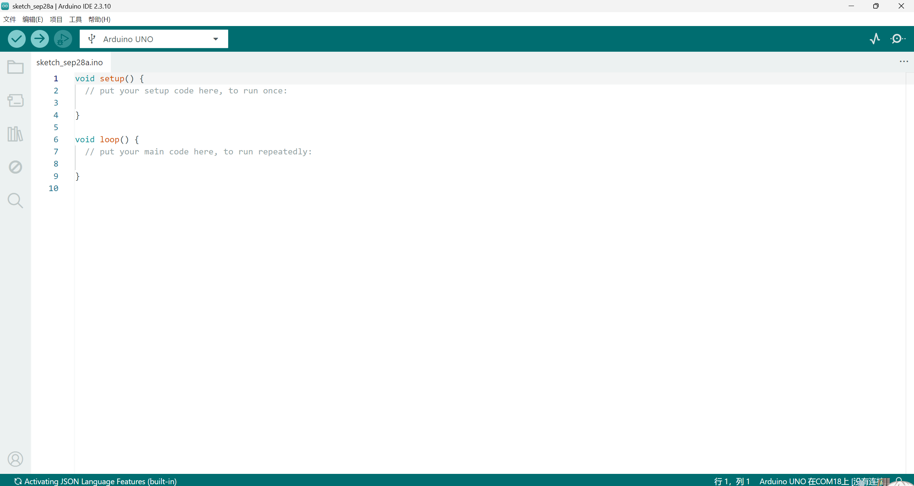

写代码什么的我就不说了，不会写代码的自己去找网课学去。

> [!NOTE]
>
> setup是初始化函数，只执行一次，loop是逻辑开发情况下的主循环。在FreeRTOS这种多线程的情况下，开启了任务调度器后，loop就没用了。

再来说一下编译和上传

这是编译:


这是上传：


请选择你的接口和开发板（不然上传不了你的代码到Arduino上）：


点击下三角形可以看到：

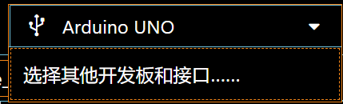

我这里是没接上数据线连接Arduino的，所以会这样很正常，但是你接上去后会显示COM多少多少的，点击后会出现板子的型号。

> [!NOTE]
>
> 火魔童开发板的话请选Arduino UNO R3

然后编译没问题就可以美美上传（烧录）代码到开发板上了。

> [!NOTE]
>
> ##### Q1：怎么导入库呢？
>
> 很简单，如图：
>
> 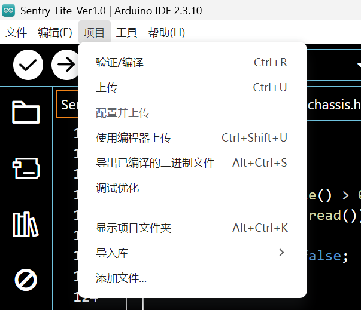
>
> 注意：导入库的时候，你要先有那个库才可以导入。
>
> ##### Q2：怎么才可以拥有库呢？
>
> 一般是在Arduino IDE中直接下载或者自己外部下载后导入（因为有些库Arduino IDE是没有的）
>
> （1）在Arduino IDE中直接下载：
>
> 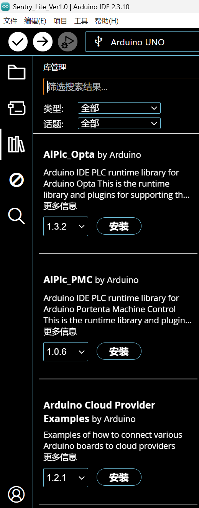
>
> （2）自己外部下载导入
>
> 参考文章：[为Arduino IDE安装添加库 – 太极创客](http://www.taichi-maker.com/homepage/reference-index/arduino-library-index/install-arduino-library/)
>
> ##### Q3：怎么添加其它文件
>
> 如图：
>
> 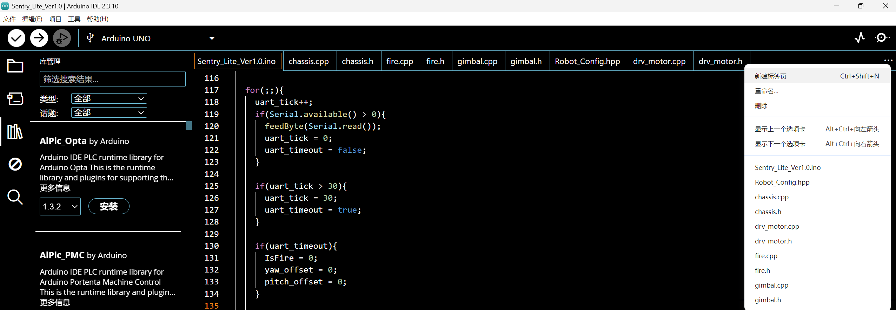
>
> 选择“新建标签页”
>
> 然后输入你定义的文件名字（必须英文），记得加后缀（“.c”、“.h”、“.cpp”、“.hpp”等）
>
> 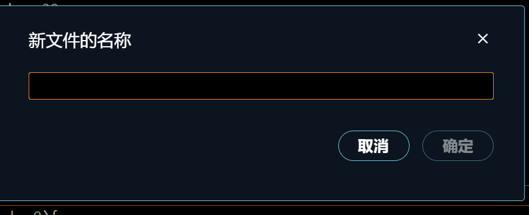
>
> 确定后就会在你的项目工程文件里出现了，最好将它们同.ino文件放在同一目录下，~~不然有的你好受的~~。

好了，基本操作教完了，还是不会就多看看。（~~看来我的文章又看了网课问了AI还是不会那么同学你就不礼貌了[doge]~~）

## 3.未来展望

其实我写的代码也挺赶的，当时很多事情做导致我们组的进度一推再推，而且组员经验远远不够，我自己调试的也很费劲了，但是好在是有惊无险的通过了最后的验收拿了验收环节的100分。

但是我还是得说一下，课设给下来的传感器根本写不出哨兵的感觉的！不要那所谓的“有同学做出来了”这种理由来搪塞学生，对于打过专业类比赛的同学来说，他们一眼就知道给来的材料根本写不出人工智能的感觉。<u>我强烈建议以后这个课设允许使用遥控器</u>，避障自瞄可以不用，但是迷宫对抗我认为必须要有，不然一天到晚放来放去跑着跑着车子的不确定性也很大，然后一群人在那看乐子还浪费时间。然后包括我电控代码也是写死的，全是动作组。人家RoboMaster的哨兵可以人工智能是因为人家有高算力MiniPC和激光雷达！~~别尬黑RoboMaster的自动哨兵。~~

但是也希望大家看了我的“版本答案”后没那么迷茫，少走一点弯路，祝大家未来可期。

有问题随时联系我的邮箱！

> [!NOTE]
>
> 最后需要说的是：
>
> 1.建议双电池方案，一块2S给底盘和火魔童开发板供电，一块2S给发射机构和继电器模块供电；
>
> 2.别用3S给火魔童供电，会烧板子；
>
> 3.动作组不确定性大，而且车子的性能严重受2S电池电量影响，建议多测试找找感觉。

## 感谢

感谢科创班的李陶然同学陪我测试火魔童开发板的所有外设。感谢武同学、蔡同学和邓同学为我们组课设作品付出的努力。

## 联系方式

邮箱：cgz314159265352021@163.com

## 幕后花絮

[虚假的哨兵](assets/video/虚假的哨兵.mp4)

[真正的哨兵](assets/video/真正的哨兵.mp4)
